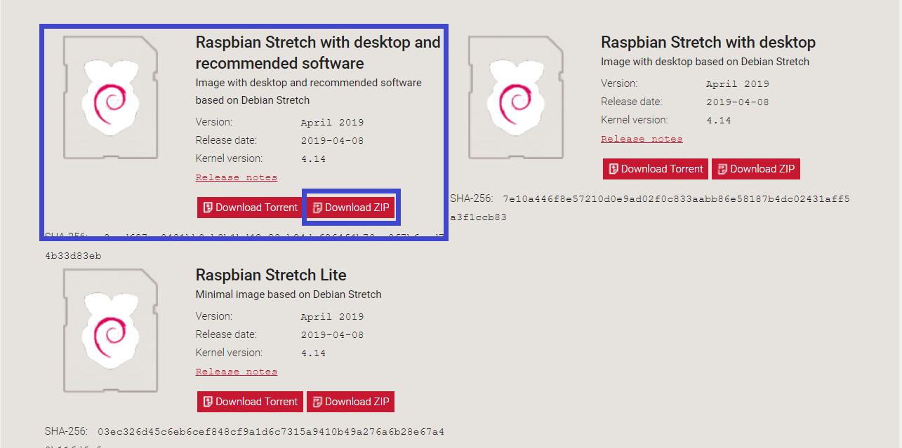

# 1. RasPi 3B+ のファイルServer化 <br>NAS[Network Attached Storage]構築手順書<br>2019年6月版
---

<!-- TOC -->

- [RasPi 3B+ のファイルServer化 <br>NAS[Network Attached Storage]構築手順書<br>2019年6月版](#raspi-3b-のファイルserver化-brnasnetwork-attached-storage構築手順書br2019年6月版)
	- [Windowsにインストールしたソフト](#windowsにインストールしたソフト)
			- [【サーバー構築に必要な Windowsソフト 】](#サーバー構築に必要な-windowsソフト-)
			- [【ターミナルソフト】](#ターミナルソフト)
			- [TeraTerm](#teraterm)
			- [【SDカード操作関連】](#sdカード操作関連)
			- [Win32DiskImager](#win32diskimager)
			- [SD Formatter](#sd-formatter)
			- [【ファイル転送】](#ファイル転送)
			- [WinSCP](#winscp)
	- [ラズパイの設定](#ラズパイの設定)
		- [OSのダウンロード](#osのダウンロード)
		- [SDへの書き込み・起動](#sdへの書き込み・起動)
		- [ソフトウェアの更新](#ソフトウェアの更新)
		- [ファームウェアの更新](#ファームウェアの更新)
		- [ラズパイの設定](#ラズパイの設定)
		- [rootパスワードの設定](#rootパスワードの設定)
		- [ネットワーク設定(IPアドレスの固定)](#ネットワーク設定ipアドレスの固定)
		- [固定したIPアドレスの確認](#固定したipアドレスの確認)
		- [SSHで接続](#sshで接続)
	- [Sambaのインストール・設定](#sambaのインストール・設定)
		- [Sambaをインストール](#sambaをインストール)
		- [vimをインストール](#vimをインストール)
		- [Sambaの設定](#sambaの設定)
		- [動作確認](#動作確認)
			- [Windows](#windows)
			- [Mac](#mac)
	- [ファイルの転送](#ファイルの転送)
		- [WinSCPの設定](#winscpの設定)
	- [参考リンク集](#参考リンク集)

<!-- /TOC -->
---

## 1.1. Windowsにインストールしたソフト

#### 1.1.1. 【サーバー構築に必要な Windowsソフト 】
最低限必要なのはSDカードにOSイメージを書き込むソフトとターミナルソフト。
他は適宜。

#### 1.1.2. 【ターミナルソフト】

#### 1.1.3. [TeraTerm](https://ja.osdn.net/projects/ttssh2/)
ネットワーク上に設置したRaspberry Piと接続して操作する

#### 1.1.4. 【SDカード操作関連】

#### 1.1.5. [Win32DiskImager](https://ja.osdn.net/projects/sfnet_win32diskimager/)
Raspberri PiのOSイメージをSDカードに書き込む。
直接OSを入れたほうがSDカードのパーティションも複雑に分割されないので

#### 1.1.6. [SD Formatter](https://www.sdcard.org/jp/downloads/formatter/index.html)
SDカードを再フォーマットするのに使う。


#### 1.1.7. 【ファイル転送】

#### 1.1.8. [WinSCP](https://winscp.net/eng/docs/lang:jp)
Raspberry Piとファイルのやり取りをする\
サーバーにFTPを入れないので必要

---

## 1.2. ラズパイの設定

### 1.2.1. OSのダウンロード
以下のリンクからRaspbian Stretch with desktop and recommended softwareをダウンロードする(ファイル名：2019-04-08-raspbian-stretch-full.zip)

[Raspbian_Downloads_Page](https://www.raspberrypi.org/downloads/raspbian/)

### 1.2.2. SDへの書き込み・起動
SD Card Formatter Win32DiskImager(balenaEtcher等)を使い書き込む
※Win32DiskImagerはWriteをクリックすること

### 1.2.3. ソフトウェアの更新
terminal上で以下のコマンドを入力する
```
sudo apt-get update
sudo apt-get upgrade
```

### 1.2.4. ファームウェアの更新
terminal上で以下のコマンドを入力する
```
sudo rpi-update
```


### 1.2.5. ラズパイの設定
ラズパイの設定からSSHを有効にする。
念のためVNCも有効にする

再起動
```
sudo reboot
```
※この段階でVNCとSSHが有効になっているので、
VNC Viewer または Tera Termが使用できる。

### 1.2.6. rootパスワードの設定
初期状態ではrootユーザのパスワードが設定されていない。
rootは管理ユーザーなので一応鍵をかけておく。
コマンドプロンプトで以下のコマンドを入力する。
```
sudo passwd root
```
入力後、続けてパスワードを入力する。
入力した文字列は表示されないが入力できている。
最後に以下の表示が出れば正常にパスが変更される。
```
passwd: password updated successfully
```

### 1.2.7. ネットワーク設定(IPアドレスの固定)
※意外とミスしやすいので注意

今後のSSH接続に備え、LAN上でのRaspberry PiのIPアドレスを固定する。\
設定ファイルは/etc/network/interfaces\
まず、初期ファイルをコピーしてバックアップします。
```
sudo cp /etc/network/interfaces /etc/network/interfaces.org
```
以下コマンドで編集に入ります。(leafpadとしてテキストファイルで編集してますがvimでもnanoでもOK)
```
sudo leafpad /etc/dhcpcd.conf
```
末尾に以下の意味の内容を追加してください(環境によって適宜変える箇所があるので注意)
- interface eth0
→ interface eth0だと有線、wlan0だとwifiなどの無線での設定
- static ip_address=[設定したい固定IPアドレス]/24
- static routers=[デフォルトゲートウェイのIPアドレス]
- static domain_name_servers=[DNSサーバーのIPアドレス]

固定したいIPアドレスは
例として192.168.100.105とする

```
interface wlan0
static ip_address=192.168.100.105/24
static routers=192.168.100.1
static domain_name_servers=192.168.100.1
```
ネットワーク設定ができたら、以下のコマンドを入力して一度シャットダウンしてください。
```
sudo shutdown -h now
```
ラズパイの電源を再投入し、
コマンドプロンプト(端末など)を起動してください

### 1.2.8. 固定したIPアドレスの確認

ラズパイを再起動後、PC側で以下のコマンドでネットワークの状態を確認
```
ping 192.168.100.105
```
ping以降のコマンドは固定化したIPアドレス


### 1.2.9. SSHで接続
PCからTeraTermを立ち上げ、ラズパイのIPアドレスを
TCP/IPのホスト(T)に入力する

OKを入力して以下の画面になれば接続に成功している

ユーザー名にpi、パスフレーズに初期設定で設定したパスワードを入力してOKを押す。
ログインできれば、TeraTerm上にコマンドプロンプトが表示される

---

## 1.3. Sambaのインストール・設定

### 1.3.1. Sambaをインストール
以下のコマンドでインストール
```
sudo apt-get install samba
```

### 1.3.2. vimをインストール
Tera Term上で作業したいのでvimをインストール
```
sudo apt-get install vim
```

### 1.3.3. Sambaの設定
```
sudo vim /etc/samba/smb.conf
```
以下の意味をもつ内容をShare Definitionsセクションに記載する
- [pi]  ⇒ 共有名。Windows上で表示されるフォルダ名
- path = /home/pi ⇒  共有するフォルダのパス
- read only = No ⇒ 読み込みも書き込みも可能
- guest ok = yes ⇒ ゲスト権限で接続
- force user = pi ⇒ ファイル操作は、ユーザー：piにより実行
```
#======================= Share Definitions =======================
・
・
[pi]
path = /home/pi
read only = No
guest ok = Yes
force user = pi
```

### 1.3.4. 動作確認

#### 1.3.4.1. Windows
エクスプローラーを開いて、左下のネットワークをクリック。\\の後に以下の固定IPアドレスを入力
```
¥¥192.168.100.105
```


#### 1.3.4.2. Mac
ファインダーを開いてCommand+Kを入力。
サーバーアドレスを聞かれるので
smb://[ラズパイのIPアドレス]を入力。
ゲストを選択して接続を行う。
マウントするボリュームはpublicを選択。

---

## 1.4. ファイルの転送

### 1.4.1. WinSCPの設定
WinSCPを起動しホスト名にラズパイのIPアドレス、ユーザー名とパスワードを入力


---

## 1.5. 参考リンク集
- [NAS(Network Attached Storage)入門](https://qiita.com/kaizen_nagoya/items/524d547c45d8277b3f17)
- [Raspberry Piで自宅ウェブサーバ立て直した話](http://shutosg.hatenadiary.com/entry/2016/01/10/181928)
- [ラズパイでファイルサーバーをつくろう](https://voltechno.com/blog/raspsamba/)
- [Raspberry Piでファイルサーバ、Part1 Samba基本編](http://denshikousaku.net/raspberry-pi-file-server-part1-basic-samba)
- [Sambaを使用してファイルを共有する方法](http://www.raspberrypirulo.net/entry/2016/08/22/Samba%E3%82%92%E4%BD%BF%E7%94%A8%E3%81%97%E3%81%A6%E3%83%95%E3%82%A1%E3%82%A4%E3%83%AB%E3%82%92%E5%85%B1%E6%9C%89%E3%81%99%E3%82%8B%E6%96%B9%E6%B3%95)
- [WinSCPでラズパイの共有フォルダ接続はネットワークドライブから出来た話](https://coronblog.net/2018/01/18/171836.html)
- [ラズベリーパイでSAMBA！NAS化するよ！](http://raspberrypi.blog.fc2.com/blog-entry-45.html)