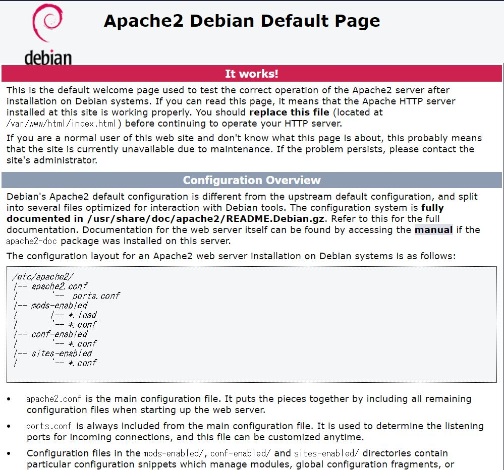

# Server化したRasPi 3B+でWEBサイトを表示する<br>Apacheを使ったWEBサーバー構築手順書<br>2019年6月版
---
ラズパイの初期設定が完了し、LANに接続できている前提の手順書です

---
## Apache
###  1. インストール
ApacheはWEBサーバアプリで、ラズベリーパイにインストールすることで
WEBページを表示できる。

ApacheだけでHTMLファイルをHTTPで表示することができる。
さらにPHPのようなスクリプト言語を使った動的なWEBページも表示することができる。

ラズパイを起動し、TeraTerm等で接続した後、
以下のコマンドを入力してApacheをインストールする。
```
sudo apt-get update
sudo apt-get install apache2
```
次のコマンドでラズパイを再起動する。
```
sudo reboot
```
###  2. ブラウザでアクセス
http://***.***.***.***　（*はラズパイのIPアドレス）に
ブラウザでアクセスすると、Apacheの画面が表示される


このファイルは/var/www/html/にindex.htmlとしてあります。
###  3. テストページを簡易ブラウザに置き換える
何も設定しないApacheは、
/var/www/html/ディレクトリ内にあるファイルを表示する
ただ、/var/www/html/index.htmlを普通に置き換えようとすると
管理者権限が無くエラーになる。
###  4. アクセス権限を変更する
以下のコマンドを入力し、htmlフォルダ内の書き込み、読み込み、実行、の権限を許可するように変更する。
```
cd /var/www
sudo chmod 777 html/
```
これで全ユーザーがhtml/内でファイルの作成や編集できる
WinSCPなどでindex.htmlファイル名をindex2.htmlに変更。
ラズパイの./var/www/html/に
test.htmlの中身を以下のように書き、ファイルを置き換える
```html
<!DOCTYPE html>
<html lang="en">
<head>
	<meta charset="UTF-8">
	<meta name="viewport" content="width=device-width, initial-scale=1.0">
	<meta http-equiv="X-UA-Compatible" content="ie=edge">
	<title>てすと</title>
</head>
<body>
	<h1>はろはろー</h1>
	<h3>これは、テストページです。</h3>
</body>
</html>
```
http://***.***.***.***（ラズパイのIPアドレス）に
ブラウザでアクセスし、test.htmlをクリックする。


http://***.***.***.***（ラズパイのIPアドレス）/index2.html
とアクセスすると2でアクセスしたApacheの画面が表示される。
###  5. httpd.confを編集する
ページを更新するために毎回./var/www/htmlにアクセスするのは面倒なので、
表示ページの設定を変更する。
以下のコマンドを入力し、htmlのアクセス場所つくる。
```
mkdir /home/pi/html
```
htmlディレクトリの中に確認用のhtmlとして、
先ほど4.で使用したtest.htmlを入れておく。
```
sudo vi /etc/apache2/sites-available/000-default.conf
```
※ vimがいやなら、VNCなどでsudo leafpad /etc/apache2/sites-available/000-default.confとして、テキストファイルを起動すると操作方法がわかりやすいと思う。

設定ファイルには、
DocumentRoot /var/www/htmlが書かれているので、
ここを以下のように変更する。
```
DocumentRoot /home/pi/html/

<Directory /home/pi/html/>
    Options Indexes FollowSymLinks
    AllowOverride None
    Require all granted
</Directory>
```
保存し、終了後、以下のコマンドを入力してdefault.configを登録する。
```
sudo a2ensite
```
これを打つと、次のようなメッセージが出る。
```
Your choices are: 000-default default-ssl
Which site(s) do you want to enable (wildcards ok)?
```
000-defaultと入力してENTER
```
000-default
```
Apacheを再起動
```
sudo /etc/init.d/apache2 restart
```
PC上で
http://***.***.***.***（ラズパイのIPアドレス）/test.htmlと入力して4.で使用したtest.htmlが表示されたら成功。